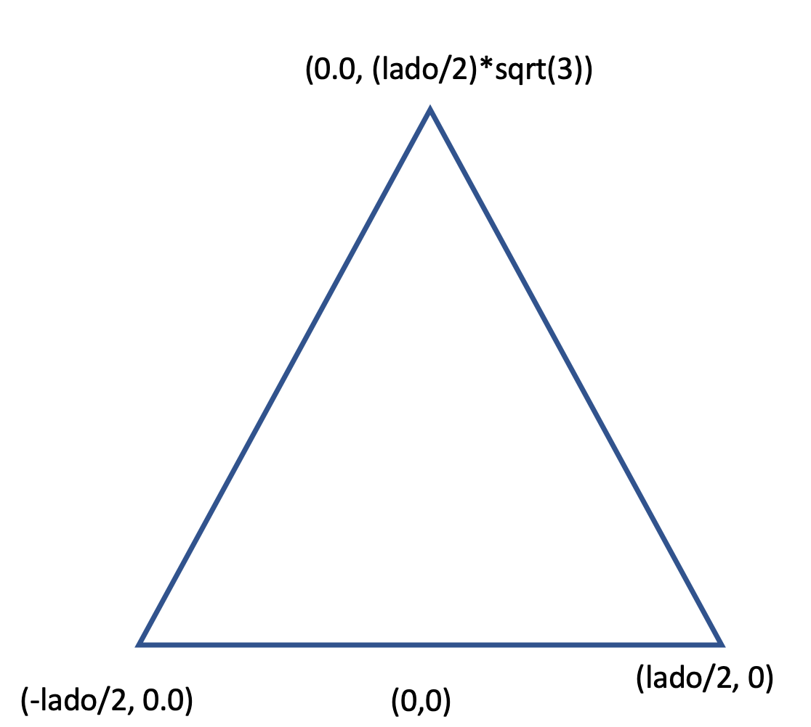

# Robótica Computacional

## Prova AF

**Você deve escolher somente 3 questões para fazer. Todo mundo que fizer pelo menos uma questão ganha 0.1**

Nome:_______________

Questões que fez:____________

Observações de avaliações nesta disciplina:
* É necessário ter pelo menos $5.0$ de nota em uma das provas
* Se você já tem uma nota, se quiser pode ver esta prova e sair sem dar commit para fazer a Sub em 18/06.
* Se você já fez a P1 e fizer esta prova, pode fazer a SUB com efeito delta (fica com no máximo 5.0)
* Tenha os repositórios https://github.com/Insper/robot20/ e https://github.com/arnaldojr/my_simulation atualizados em seu catkin_ws/src .
* Você pode consultar a internet ou qualquer material, mas não pode se comunicar com pessoas ou colegas a respeito da prova
* Ponha o nome no enunciado da prova no Github
* Faça commits e pushes frequentes no seu repositório (tem dicas [no final deste arquivo](./inst
rucoes_setup.md))
* Use uma foto real sua no perfil do Teams. Se você *não tiver* vamos ligar para você e será obrigatório abrir a câmera
* Esteja conectado no Teams e pronto para receber calls do professor e da equipe. 
* Se precisar se ausentar temporariamente, avise no chat da prova
* Permite-se consultar qualquer material online ou próprio. Não se pode compartilhar informações com colegas durante a prova
* Faça commits frequentes. O primeiro a enviar alguma ideia será considerado autor original
* A responsabilidade por ter o *setup* funcionando é de cada estudante
* Questões de esclarecimento geral podem ser perguntadas no chat do Teams
* Se você estiver em casa pode falar com seus familiares, mas não pode receber ajuda na prova.
* É vedado colaborar ou pedir ajuda a colegas ou qualquer pessoa que conheça os assuntos avaliados nesta prova.

Existe algumas dicas de referência rápida de setup [instrucoes_setup.md](instrucoes_setup.md)

**Integridade Intelectual**

Se você tiver alguma evidência de fraude cometida nesta prova, [use este serviço de e-mail anônimo](https://www.guerrillamail.com/pt/compose)  para informar ao professor.  Ou [este formulário](https://forms.gle/JPhqjPmuKAHxmvwZ9)

# Setup 

Veja instruções sobre como baixar os vídeos necessários. 

# Questões

## Questão 1  (3.3 pontos)

O padrão a seguir foi impresso numa folha. Alguém segurou este padrão em frente ao computador com a folha paralela à tela a uma distância de 1 m e obteve a imagem que está no arquivo `q1\imagem_1metro.png`, que também pode ser vista abaixo

</img>

As distâncias presentes no padrão são as seguintes:

</img>

Lembre-se ainda do modelo *pinhole* de câmera: 

</img>

Baixe o [vídeo padrao.mp4 neste link](https://alinsperedu.sharepoint.com/:f:/s/RobticaComputacional1.osem2020/EocJXBJnro9MmyeGm_J8EqEBygumF6unizAfZIsAxTebpQ?e=3Bubnr) e salve na pasta `q1`.

#### O que você deve fazer:

Dadas as informações fornecidas um programa que imprime a distância D entre a folha e a câmera a cada frame.

Deixe clara qual medida você está fazendo no padrão e qual a fórmula encontrada para D.

Se você realizou alguma medida manual, anote. 

#### Orientações

Execute o programa `q1/q1.py`. Este exercício **não precisa** de ROS

Você vai notar que este programa roda o vídeo ``padrao.mp4`. 

#### O que você deve fazer:

|Resultado| Conceito| 
|---|---|
| Não executa e nem explica nada | 0 |
| Explique quais valores do modelo pinhole são necessários e os calcula| 0.75|
| Segmenta cores para alcançar objetivos  | 1.5 |
| Vai um nível além das cores, por exemplos com contornos, formas e distâncias | 2.3 |
| Imprime sempre corretamente a distância D | 3.3 | 

Casos intermediários ou omissos da rubrica serão decididos pelo professor.

## Questão 2 (3.3 pontos)

#### Contexto

Você foi contratado por uma empresa de *media tracking* para monitorar quando o logotipo de uma empresa é colocado sobre a programação de uma TV.

</img>

O vídeo `logomarca.mp4` contém o vídeo de um campeonato de Mountain Bike. Deve ser baixado [neste link]((https://alinsperedu.sharepoint.com/:f:/s/RobticaComputacional1.osem2020/EocJXBJnro9MmyeGm_J8EqEBygumF6unizAfZIsAxTebpQ?e=3Bubnr)) e salvo na pasta `q2`.

</img>

Existe também uma imagem da pomba em preto e branco em `./q2/pomba_gray.png`

#### Orientações

O código base para este exercício está em `q2/q2.py`. Este exercício **não precisa** de ROS

Dica: Talvez você se interesse pelo notebook de *Feature tracking*.

**O que você deve fazer**:

Apontar corretamente quando o logo desejado aparece na cor correta, contendo o fundo vermelho. Você não deve apontar quando este logo aparecer em preto e branco.

Você deve desenhar um retângulo ao redor do padrão.

O apontamento não precisa ser feito na tela, pode ser feito no terminal.

|Resultado| Conceito| 
|---|---|
| Não executa | 0 |
| Identifica algum pombo corretamente usando features  | 1.8 |
| Faz algum processamento de cor, mas ainda não é perfeito  | 2.3 |
| Funciona perfeitamente | 3.3 | 

Casos intermediários ou omissos da rubrica serão decididos pelo professor.

## Questão 3  (3.3 pontos)

#### O que é para fazer

Crie uma função `go_to(x,y)` que deve ser invocada no `main`  e faz o robô ir de forma bem-sucedida até a posição `(x,y)`. 

Esta função precisa usar a odometria para monitorar se o `x,y` alcançado está certo.

Depois que o robô chegar na posição certa com uma tolerância de `30cm` precisa parar.

Caso o robô chegue a uma distância maior que a tolerância, precisa continuar rodando a função `(x,y)` até a meta ser alcançada.

Após fazer a função acima, faça o robô desenhar no chão o triângulo equilátero especificado abaixo.

Escola um valor razoável para a variável `lado`. 

</img>

O código para este exercício está em `p2_20/scripts/Q3_controle.py`.

Para executar, recomendamos que faça: 

    roslaunch turtlebot3_gazebo  turtlebot3_empty_world.launch

Depois:

    rosrun p1_20 Q3_controle.py

**Cuidado com teleops esquecidos** 

O código exemplo traz praticamente tudo que você precisa saber sobre o tópico `/odom`. Analise-o com cuidado.

|Resultado| Conceito| 
|---|---|
| Não executa | 0 |
| Chega na posição x,y sem usar odometria| 1.0|
| Usa odometria para chjegar na posição x,y | 2.5 |
| Usa a função desenvolvida para fazer o triângulo | 3.3 |

Casos intermediários ou omissos da rubrica serão decididos pelo professor.

## Questão 4 (3.3 pontos)

A sua esfera designada serã da seguinte forma

*Escreva seu RA na prova*

Se seu RA for impar, a esfera serã verde

Se seu RA for par, a esfera serã azul

#### O que é para fazer

Um código que faz o robô chegar e 1.0 m perto da sua esfera designada e parar. Você deve usar para tal uma combinação de *laser* e câmera. 

#### Detalhes de como rodar

O código para este exercício está em: `p2_20/scripts/Q4_formas.py`

Para rodar, recomendamos que faça:

    roslaunch my_simulation formas.launch

Depois:

    rosrun p1_20 Q4_formas.py

|Resultado| Conceito| 
|---|---|
| Não executa | 0 |
| Consegue segmentar os pixels em objetos sem identificar sua esfera | 1.0 |
| Identifica qual a esfera correta | 3.0 |
| Faz a abordagem baseada em câmera e laser para se aproximar corretamente | 3.3 | 

Casos intermediários ou omissos da rubrica serão decididos pelo professor.

